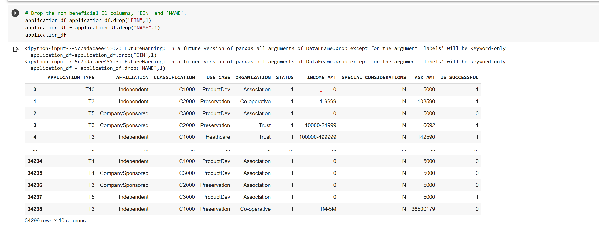

# Report on the Neural Network Model

  With your knowledge of machine learning and neural networks, you’ll use the features in the provided dataset to help Beks create a binary classifier that is capable of predicting whether applicants will be successful if funded by Alphabet Soup.

From Alphabet Soup’s business team, Beks received a CSV containing more than 34,000 organizations that have received funding from Alphabet Soup over the years. Within this dataset are a number of columns that capture metadata about each organization, such as the following:

## Overview of the analysis
   In this analysis we perform the Machine Learning and nural networks, we ll use **Charity_data.csv** file as our dataset and use this dataset's features for creating the **Binary Classifier** and make sure it that it is capable of predicting whether applicant be successful if funded by **Alphabet Soup**.
   **Charity_data.csv**file contains the following columns with about more then 34,000 of received funding data.
   
   - EIN and NAME—Identification columns
   - APPLICATION_TYPE—Alphabet Soup application type
   - AFFILIATION—Affiliated sector of industry
   - CLASSIFICATION—Government organization classification
   - USE_CASE—Use case for funding
   - ORGANIZATION—Organization type
   - STATUS—Active status
   - INCOME_AMT—Income classification
   - SPECIAL_CONSIDERATIONS—Special consideration for application
   - ASK_AMT—Funding amount requested
   - IS_SUCCESSFUL—Was the money used effectively
   

## Results:

    We works for 3 Deliverable here , 
    Deliverable 1: In this deliverable we Preprocessing Data for a Neural Network Model.
    Deliverable 2: We Compile, Train, and Evaluate the Model data which we got in the Deliverable 1.
    Deliverable 3: In this deliverable we optimize the model.
    
 * ### Data Preprocessing
 * What variable(s) are considered the target(s) for your model?
     * The variable we are targeting in this module is the IS_SUCCESSFUL column.

 * What variable(s) are considered to be the features for your model?
      * The following columns are the features for this model: APPLICATION_TYPE, AFFILIATION, CLASSIFICATION, USE_CASE, ORGANIZATION, STATUS, INCOME_AMT,         SPECIAL_CONSIDERATIONS, ASK_AMT.

 * What variable(s) are neither targets nor features, and should be removed from the input data?
      * The columns that are neither targers nor features and are removed from the input data are EIN and NAME because they represents identification information and have little to do with our outcome.
      we can see that in following images.
    **Delievrabale 1:** 
    1) After import the csv file as a DataFrame we **Drop EIN and NAME** columns.(Image:1)
    
    
    
    2) Now, we populate the unique values of each columns and count the values for **APPLICATION_TYPE** column.
    
    
    
    3) Now repeate the same task for **CLASSIFICATION** column.
    4) Generate the binning for both Classification and Application_type column.
    
    
    
    
    5) Generate the **categorical variable list** and **OneHotEncoder**
    
    
    
    6) Merge Encoded faetures in DataFrame.
    
    
    
    7) **Split Preprocessed Data into Training and Testing dataset**.
    
    8) create and fit **StandardScaler** then **scale the data**
    
    
    
 * ### Compiling, Training, and Evaluating the Model
  **Deliverable 2:**
   In this deliverable we have to compile,train and evaluate the model from preprocessing data which we get in Delievrable 1:
   1) In this step we create the hidden layer or define the Hidden nodes and layers for compiling.
   
   * How many neurons, layers, and activation functions did you select for your neural network model, and why?
        * As shown in Fig. 1 below, this model is made with an input feature, two hidden layers, and an output layer. The first hidden layer has 80 neurons, while the second has 30 neurons. Each layer has an activation function: The first and second hidden layers have an activation function "relu" and the output layer has an activation function "sigmoid".
   
   
   
   2) After that we compile the model with the use of **compile()*.
   
   
   
   3) Train the model with train variables we created before and assign **epochs value as 100**.
  * Were you able to achieve the target model performance?
      * Using this neural network model, our accuracy was only 72.7% as shown in Fig. 2. Therefore, we did not achieve the target model performance of 75%.
    
   

**Deliverable 3:**
Deliverable 3 is the optimization of **AlphabetSoupCharity**..
we perform the same preprocessing as we did in the deliverable 1 and 2 untill training and testing the data but in this deliverable when we generate or assign the Hidden_nodes_layers we make some chnages over there ,

  1) assign **input_features as the length of X_train_scaled**
  
  
  
  2) Then, we import the checkpoint Dependencies.
  3) after compile the model here we create a **callback** that saves **model weight** every **5 epoches**.
  
  
  
  4) after that step we can train the model and find the **Accuracy** which is more then **75%(0.7949)**.
  
  

   
## Summary
  **As per my summury all deliverable contain all the needs mentioned in the module challenge as well as in Deliverable 3 as per my Model Accuracy result it acheive the target of performance 75%.**

